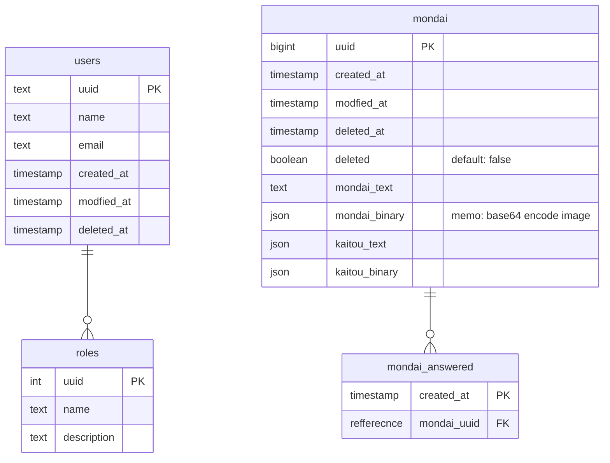

# [denkou-kakomon-dotcom](https://github.com/n138-kz/denkou-kakomon-dotcom)

## Activity

## License

  
[Copyright (c) 2024 Yuu Komiya (n138)](LICENSE)  

## Database E-R

```mermaid
erDiagram
users ||--o{ roles: "" 
mondai ||--o{ mondai_answered: "" 

users {
    text uuid PK
    text name
    text email
    timestamp created_at
    timestamp modfied_at
    timestamp deleted_at
}

roles {
    int uuid PK
    text name
    text description
}

mondai {
    bigint uuid PK
    timestamp created_at
    timestamp modfied_at
    timestamp deleted_at
    boolean deleted "default: false"
    text mondai_text
    json mondai_binary "memo: base64 encode image"
    json kaitou_text
    json kaitou_binary
}

mondai_answered {
    timestamp created_at PK
    refferecnce mondai_uuid FK
}
```
